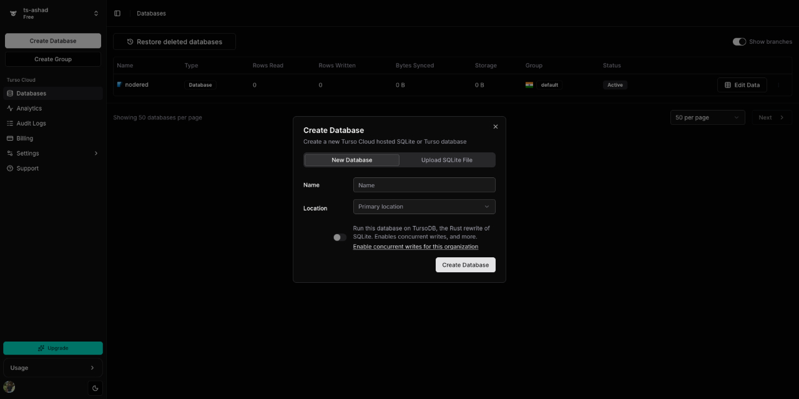
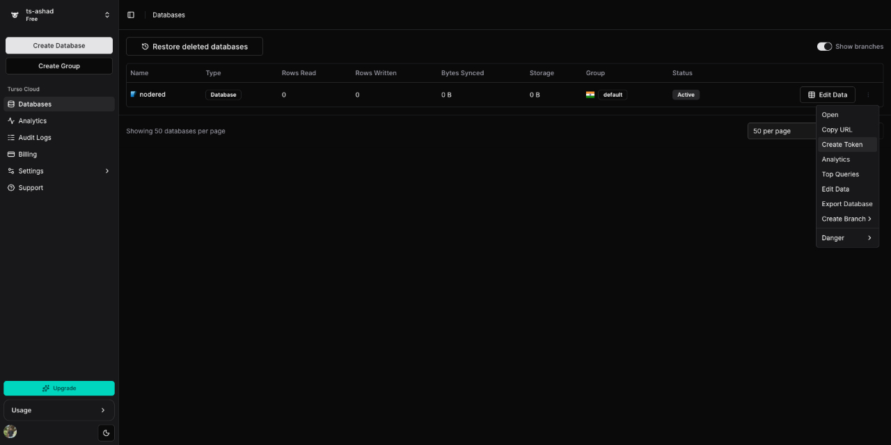
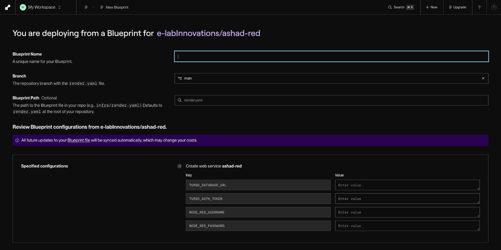
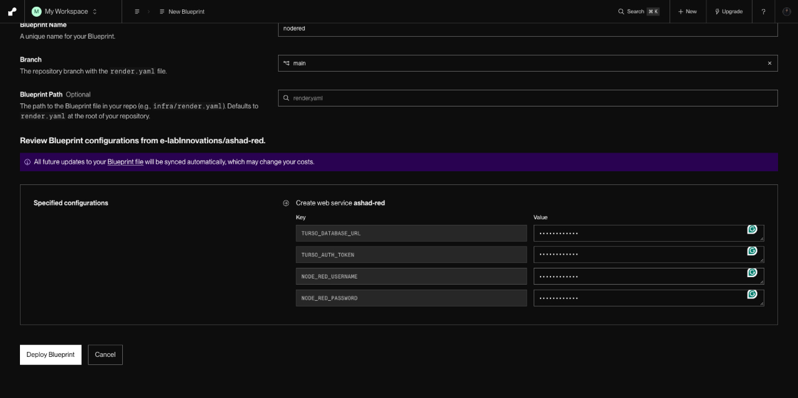
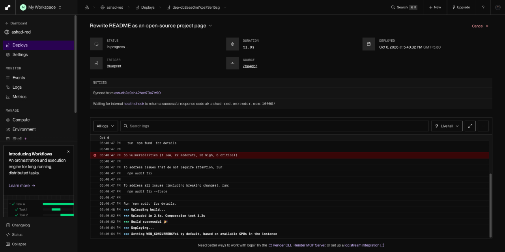
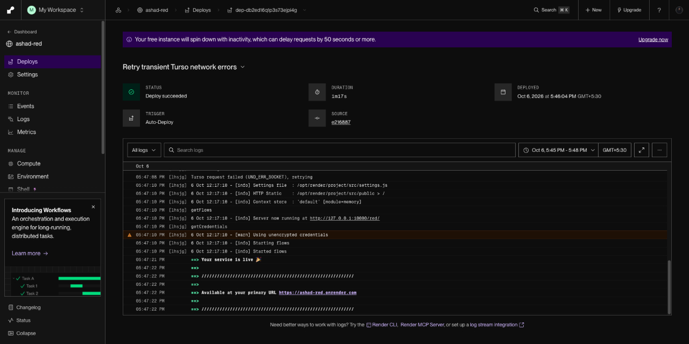
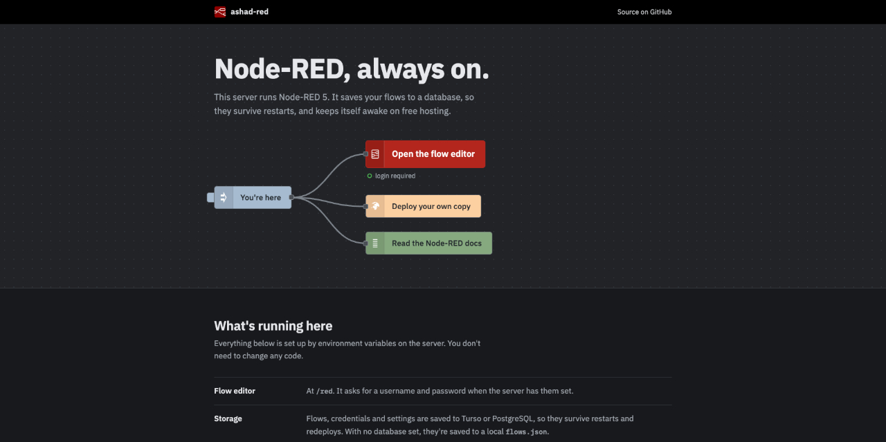
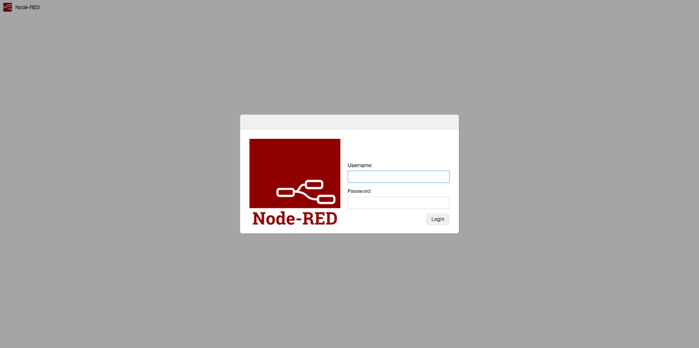
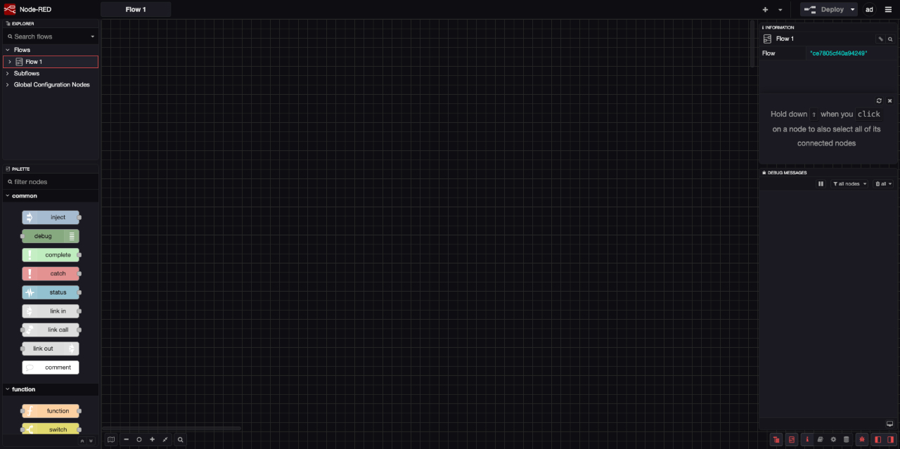

# Run Node-RED 24/7 for Free on Render with Turso or Neon


A few years back I wrote a tutorial on [deploying Node-RED to Heroku](https://elabins.com/blog/deploying-node-red-into-heroku). It was one button and two passwords. Then Heroku ended its free dynos in November 2022, and that post turned into a warning label.

I still want a Node-RED instance in the cloud. As an embedded person, my usual home for Node-RED is a Raspberry Pi on the desk, but a Pi behind a home router is awkward when an ESP32 in the field needs to hit an HTTP endpoint, or when I want a webhook to land somewhere that is always up. So I went looking for the next free home and landed on Render.

Render's free web service gives you 750 instance hours a month. A 31-day month is 744 hours, so a single Node-RED instance can run 24/7 on it. The catch is in the details, and there are two of them. This post is the tutorial for my setup, plus the reasons it is shaped the way it is.

## The two problems with free hosting

The first problem is the disk. Render's free service has no persistent disk. Node-RED, by default, saves your flows to `flows.json` in its user directory. Every redeploy, and every restart, starts from a fresh copy of the repo, so your flows quietly disappear.

The second problem is sleep. A free Render service spins down after 15 minutes without incoming traffic. Render's own dashboard banner puts it plainly:

<!-- block:pullQuote -->
> Your free instance will spin down with inactivity, which can delay requests by 50 seconds or more.
<!-- /block:pullQuote -->

For a dashboard you open once a day, that is annoying. For an IoT backend that a device calls on a schedule, a 50-second cold start is a timeout.

I put together a repo, [ashad-red](https://github.com/e-labInnovations/ashad-red), that fixes both: Node-RED 5 with the flows stored in a database, and a keep-alive that stops Render from putting it to sleep.

### Turso or Neon

Node-RED's storage is pluggable. The [storage API](https://nodered.org/docs/api/storage/) is a small set of methods (`getFlows`, `saveFlows`, `getCredentials`, `getSettings`, `getSessions`, the library pair, and their save counterparts), and you can point `settings.js` at your own module that implements them. ashad-red ships one that talks to either Turso or PostgreSQL, and picks based on which environment variable you set.

Both have a free tier that comfortably fits this job, so the choice comes down to what you already use.

| | Turso (libSQL) | Neon (PostgreSQL) |
|---|---|---|
| What it is | Hosted SQLite, queried over HTTPS | Serverless Postgres |
| How the app connects | Stateless HTTPS requests | TCP connection pool |
| When idle | Nothing to wake | Scales to zero, wakes on the next query |
| Set in Render | `TURSO_DATABASE_URL`, `TURSO_AUTH_TOKEN` | `DATABASE_URL` |
| Local testing | `file:local.db`, no server needed | Needs a Postgres server |
| Good if | You want the least moving parts | You already know Postgres, or want to query the data with normal SQL tools |

My own default is Turso, and the deciding axis was complexity. Node-RED's whole state for one instance is a handful of JSON blobs: the flows, the credentials, the user settings and the login sessions. Each one is a few kilobytes, written when you click Deploy or log in, and read once at startup. SQLite over HTTP fits that, and the same code runs against a local SQLite file on my laptop.

Neon is the better pick if Postgres is already your tool. It's plain Postgres, so you can open the tables in `psql` or any SQL client, back them up with `pg_dump`, and keep other app data in the same project. Its scale-to-zero suits Node-RED's access pattern well: the database is only touched on deploys and logins, so it spends most of its life asleep and barely uses compute. The cost is a short wake-up on the first query after a quiet spell, which you'll only notice as a slightly slower deploy or login.

The tutorial covers both. Pick one in step 1 and the rest is the same.

## What you need

- A free [Turso](https://turso.tech) or [Neon](https://neon.tech) account.
- A free [Render](https://render.com) account.
- About ten minutes. The Render build takes a minute or two of that.

## Step 1: Create the database

### Option A: Turso

Sign in at [app.turso.tech](https://app.turso.tech) and click **Create Database**. Give it a name (I used `nodered`) and pick a location close to where Render will run your app.

<!-- IMAGE: Turso dashboard with the Create Database dialog open -->

*Creating the database. I left the TursoDB toggle off; plain libSQL is all this needs.*

Back on the Databases list, open the menu on your database's row. You need two things from it:

1. **Copy URL**. It looks like `libsql://nodered-<your-org>.turso.io`.
2. **Create Token**. Node-RED writes to the database every time you deploy a flow, so the token must allow writes.

<!-- IMAGE: Turso database row menu showing Copy URL and Create Token -->

*Both values you need live in this menu.*

<!-- block:callout {"kind":"warning","title":"Save the token now","content":"Turso shows the token once. Paste it somewhere safe before closing the dialog, or you will be making a second one."} -->
> [!WARNING] Save the token now
> Turso shows the token once. Paste it somewhere safe before closing the dialog, or you will be making a second one.
<!-- /block:callout -->

### Option B: Neon

Sign in at [console.neon.tech](https://console.neon.tech) and create a new project. Give it a name, keep the default Postgres version, and pick a region close to your Render service.

<!-- IMAGE: Neon console, New Project dialog with name, Postgres version and region -->

*A new Neon project. The default database it creates is enough; ashad-red makes its own tables on first start.*

On the project dashboard, click **Connect** and copy the connection string. It looks like this:

<!-- block:code {"language":"plain","filename":"Neon connection string","showLineNumbers":false} -->
```plain
// Neon connection string
postgresql://<user>:<password>@ep-<name>.<region>.aws.neon.tech/neondb?sslmode=require
```
<!-- /block:code -->

<!-- IMAGE: Neon Connect dialog showing the connection string -->

*Copy the whole string, including the sslmode part.*

Neon offers a direct and a pooled (`-pooler`) host. Either works here; ashad-red keeps its own small pool and doesn't use named prepared statements, which is the usual thing that breaks behind a pooler. If the string ends with `&channel_binding=require`, you can leave it in; the Postgres client ignores it.

You don't need to create any tables. On first start ashad-red runs `CREATE TABLE IF NOT EXISTS` for the three it uses.

## Step 2: Deploy with the button

This is the part that replaces Heroku's button. The repo has a `render.yaml` file, which Render calls a Blueprint. It describes the service so you don't have to click through settings by hand:

<!-- block:code {"language":"yaml","filename":"render.yaml","showLineNumbers":false} -->
```yaml
# render.yaml
services:
  - type: web
    name: ashad-red
    runtime: node
    plan: free
    buildCommand: npm install
    startCommand: npm start
    healthCheckPath: /
    envVars:
      - key: NODE_VERSION
        value: "24"
      - key: TURSO_DATABASE_URL
        sync: false
      - key: TURSO_AUTH_TOKEN
        sync: false
      # Or use Postgres (e.g. Neon): leave the two Turso values blank
      - key: DATABASE_URL
        sync: false
      - key: NODE_RED_USERNAME
        sync: false
      - key: NODE_RED_PASSWORD
        sync: false
```
<!-- /block:code -->

`sync: false` is what makes Render ask you for those values during setup instead of storing them in the repo. `NODE_VERSION` is pinned because Node-RED 5 needs Node 22.9 or later, and I didn't want to depend on whatever Render defaults to that month.

Click the button to start:

<!-- block:buttonLink {"label":"Deploy to Render","url":"https://render.com/deploy?repo=https://github.com/e-labInnovations/ashad-red","variant":"default","newTab":true} -->[Deploy to Render](https://render.com/deploy?repo=https://github.com/e-labInnovations/ashad-red)<!-- /block:buttonLink -->

Render opens a "You are deploying from a Blueprint" page with the variables waiting for values. My screenshots are from before I added `DATABASE_URL`, so your form has one more field than these.

<!-- IMAGE: Render Blueprint page, empty -->

*The Blueprint asks for exactly the values marked sync: false.*

Fill it in:

| Field | Value |
|---|---|
| Blueprint Name | Anything; I used `nodered` |
| `TURSO_DATABASE_URL` | Turso only: the `libsql://` URL. Blank for Neon. |
| `TURSO_AUTH_TOKEN` | Turso only: the token. Blank for Neon. |
| `DATABASE_URL` | Neon only: the connection string. Blank for Turso. |
| `NODE_RED_USERNAME` | The editor login you want |
| `NODE_RED_PASSWORD` | The editor password you want |

<!-- IMAGE: Render Blueprint page, filled in -->

*Filled in and ready. Then Deploy Blueprint.*

<!-- block:callout {"kind":"warning","title":"Fill one database, not both","content":"If TURSO_DATABASE_URL has any value, ashad-red uses Turso and ignores DATABASE_URL. For Neon, leave both Turso fields empty."} -->
> [!WARNING] Fill one database, not both
> If TURSO_DATABASE_URL has any value, ashad-red uses Turso and ignores DATABASE_URL. For Neon, leave both Turso fields empty.
<!-- /block:callout -->

Click **Deploy Blueprint**. In my old Heroku post I had a whole section about the editor rejecting the password on first login and fixing it in Config Vars. That problem doesn't exist here, because the login is read straight from these environment variables on every start.

## Step 3: Watch the build

Render runs `npm install`, uploads the build, then starts Node-RED and waits for the health check on `/` to return 200.

<!-- IMAGE: Render deploy page with build log in progress -->

*The build. Yes, npm audit is unhappy.*

You will see `npm audit` report a few dozen vulnerabilities in the build log. Most of them come from old dependencies in the repo that predate this rewrite (an old `firebase-admin`, `nano`, `redis` and `feedparser`), not from Node-RED itself. They are on my list to clean out. The build still succeeds.

When it's live, the log ends with the service URL. My deploy took 1m 17s.

<!-- IMAGE: Render deploy succeeded -->

*Live. Node-RED has started its flows and Render has switched traffic over.*

## Step 4: Open your Node-RED

Visit `https://<your-app>.onrender.com`. Instead of the old static Heroku page, the home page is drawn as a small Node-RED flow: an inject node wired to the editor, the deploy button and the docs.

<!-- IMAGE: ashad-red landing page in dark mode -->

*The status under the editor node is live: it calls Node-RED's auth endpoint and shows "login required" when a password is set.*

That status line is there for a reason. If you forget to set the username and password, it turns into a red dot that says the editor is open to anyone. A public Node-RED editor is a public remote code runner, so I wanted that to be impossible to miss.

Click **Open the flow editor**, and log in with the username and password from step 2.

<!-- IMAGE: Node-RED login page -->

*The standard Node-RED login, served from /red.*

<!-- IMAGE: Node-RED 5 flow editor in dark theme -->

*Node-RED 5. The dark theme here comes from my OS setting; the editor follows the system theme by default.*

Build a flow, click **Deploy**, then trigger a manual deploy or restart on Render. The flow comes back, because it was never on Render's disk.

## How it stays awake

The keep-alive is the part I was least sure about, so here is exactly what it does.

Render sets an environment variable called `RENDER_EXTERNAL_URL` on every web service, holding its public address. ashad-red reads it at startup and, every 10 minutes, makes an HTTP request to that address. You'll see it in the log:

<!-- block:code {"language":"plain","filename":"Render log","showLineNumbers":false} -->
```plain
// Render log
Using turso storage
Keep-alive: pinging https://ashad-red.onrender.com every 10 min
```
<!-- /block:code -->

With Neon the first line reads `Using postgres storage` instead.

Why would an app pinging itself count as traffic? Because the request doesn't go to localhost. It leaves the container, goes out to the public internet, and comes back in through Render's edge proxy like any other visitor. As far as I can tell, Render decides whether a service is idle from what arrives at that proxy, so from its point of view somebody visits every 10 minutes. Ten, not fifteen, so a slightly late ping still lands inside the window.

The ping hits the static home page, not the editor, so it's cheap and doesn't need a login. It also never touches the database. That matters with Neon: Render stays awake while Neon is still free to scale to zero, so you aren't paying compute hours just to keep the web server up.

<!-- block:details {"summary":"Optional: a keep-alive that lives outside Render","open":false} -->
<details>
<summary>Optional: a keep-alive that lives outside Render</summary>

The self-ping has one blind spot: if the app has stopped for some other reason, it can't ping itself awake. The repo also includes a Google Apps Script in scripts/keep-alive.gs. Paste it into a new project at script.google.com, add a script property called APP_URL with your Render URL, and run setupTrigger once. It requests your app every 10 minutes from Google's side and logs each result under Executions.

</details>
<!-- /block:details -->

I haven't watched it through a full billing month yet. If Render ever decides self-pings don't count, the Apps Script above is the fallback, and the 744-out-of-750 hours maths still holds.

## What to know before you rely on it

A few things this setup does not do, so you aren't surprised later:

- **Context is not saved.** Values from `flow.set()` and `global.set()` live in memory and are gone after a restart. If a device counter matters, write it to a database node.
- **Credentials are stored unencrypted** in the database (`credentialSecret: false`). Keep your Turso token or Neon connection string private; anyone with either can read them.
- **On Neon, the first database access after a quiet spell is slower** while the compute wakes up. That only affects deploys, logins and settings saves, never your running flows, which don't read from the database.
- **Some core nodes are disabled:** `exec`, `file`, `watch`, `tcp` and `udp`. There is no persistent disk to write files to, Render doesn't accept raw TCP or UDP from outside, and `exec` on a public server is a shell waiting to happen. You can turn them back on in `settings.js` if you know why you want them.
- **The 750 hours are per workspace,** not per service. A second always-on free service on the same Render account will run out partway through the month.
- **Palette installs don't survive a rebuild.** Node-RED reinstalls the modules your flows use on the next start, which makes that start slower. Add anything permanent to `package.json`.

## Where this leaves it

The Heroku version of this post was shorter because Heroku did more for you, until it didn't. This version has more moving parts, but each one is small and replaceable: a database you can switch between Turso and Neon by changing environment variables, a keep-alive you can turn off with `KEEP_ALIVE=false`, and a host you could leave for any Node.js platform with Node 22.9 or later.

If you deploy it and something breaks, open an issue on the repo.

<!-- block:gitHubRepo {"owner":"e-labInnovations","repo":"ashad-red"} -->
**[e-labInnovations/ashad-red](https://github.com/e-labInnovations/ashad-red)**
<!-- /block:gitHubRepo -->

<!-- block:buttonGroup {"buttons_count":2} -->
- [Deploy to Render](https://render.com/deploy?repo=https://github.com/e-labInnovations/ashad-red)
- [Source on GitHub](https://github.com/e-labInnovations/ashad-red)
<!-- /block:buttonGroup -->

<!--
IMAGE MANIFEST (all in images/, prefix node-red-render-)
- node-red-render-thumbnail.png               cover, 16:9, TO CREATE (see write-blog-post assets/thumbnail-prompt.md)
- node-red-render-turso-create-database.jpg   step 1A, Turso Create Database
- node-red-render-turso-create-token.jpg      step 1A, Copy URL / Create Token menu
- node-red-render-neon-create-project.png     step 1B, Neon New Project, TO CAPTURE
- node-red-render-neon-connection-string.png  step 1B, Neon Connect dialog, TO CAPTURE (blur the password)
- node-red-render-blueprint-form.jpg          step 2, empty Blueprint page
- node-red-render-blueprint-filled.jpg        step 2, filled in
- node-red-render-build-log.jpg               step 3, build in progress
- node-red-render-deploy-live.jpg             step 3, deploy succeeded
- node-red-render-landing-page.jpg            step 4, home page
- node-red-render-editor-login.jpg            step 4, login
- node-red-render-flow-editor.jpg             step 4, editor
-->
