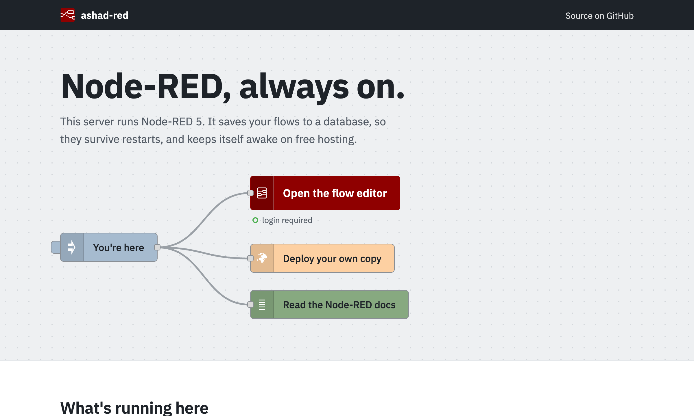

# ashad-red

**Node-RED 5 for free cloud hosting.** It keeps your flows in a database, so restarts and redeploys don't wipe them, and it keeps itself awake on Render's free plan.

[](LICENSE)
[](https://nodered.org)
[](https://nodejs.org)

[](https://render.com/deploy?repo=https://github.com/e-labInnovations/ashad-red)



## Why

Free hosts like Render give you a server with no persistent disk. Plain Node-RED saves flows to files, so every restart or redeploy loses them, and the free plan also puts the app to sleep after 15 minutes of no traffic.

ashad-red is a ready-made Node-RED setup that fixes both:

- **Flows survive restarts.** Flows, credentials, settings, library entries and editor login sessions are stored in **Turso** (libSQL) or **PostgreSQL**, such as Neon.
- **Always on.** The app pings its own public URL every 10 minutes, so Render doesn't put it to sleep.
- **One-click deploy.** The Render button sets up the service and asks only for your database and login details.
- **Editor login** from two environment variables.
- **Safer defaults.** Nodes that run shell commands or touch the server's files are turned off.
- **System light/dark theme** in the editor, and a home page that links to it.

## Quick start: free deploy with Turso and Render

For a step-by-step walkthrough with screenshots, including the Neon option, read the tutorial:

[](https://elabins.com/blog/run-node-red-247-for-free-on-render-with-turso-or-neon)

You need free accounts on [Turso](https://turso.tech) and [Render](https://render.com).

1. **Create a database.** In [app.turso.tech](https://app.turso.tech), create a database. Copy its URL (`libsql://<db>-<org>.turso.io`) and create a token for it. The token is shown only once.
2. **Deploy.** Click **Deploy to Render** above and fill in:

   | Variable | Value |
   |---|---|
   | `TURSO_DATABASE_URL` | Database URL from step 1 |
   | `TURSO_AUTH_TOKEN` | Token from step 1 |
   | `DATABASE_URL` | Leave blank. For Neon instead of Turso, put the Neon connection string here and leave the two Turso fields blank. |
   | `NODE_RED_USERNAME` | Editor login name you choose |
   | `NODE_RED_PASSWORD` | Editor password you choose |

3. **Sign in.** When the deploy finishes, open `https://<your-app>.onrender.com/red`.

That's all. Keep-alive starts on its own; the log shows `Keep-alive: pinging https://<your-app>.onrender.com every 10 min`.

Render's free plan gives 750 instance hours a month, and a 31-day month is 744 hours, so one always-on service fits. The hours are shared across your Render workspace. Free-plan limits change, so check Render's pricing page.

## Choosing a database

The first backend that's configured is used, and the startup log says which one, for example `Using turso storage`. Tables are created on first start.

| Backend | Set | Good for |
|---|---|---|
| [Turso](https://turso.tech) | `TURSO_DATABASE_URL`, `TURSO_AUTH_TOKEN` | Free hosted SQLite. The recommended default. |
| PostgreSQL | `DATABASE_URL` | Any Postgres, including hosted ones like [Neon](https://neon.tech), Supabase or Render Postgres |
| Local files | neither | Running on your own machine. Flows go to `flows.json`. |

If both are set, Turso wins.

**Using Neon:** copy the connection string from the Neon console (direct or pooled) into `DATABASE_URL`. The free tier suspends the database when it's idle, so the first save or login after a quiet spell takes a moment longer while it wakes.

**Moving from PostgreSQL to Turso:** set `DATABASE_URL`, `TURSO_DATABASE_URL` and `TURSO_AUTH_TOKEN`, then run `npm run migrate:turso`. It copies every row and stops if the Turso tables already contain data. Back up Postgres first.

## Running locally

Requires Node.js 22.9 or later (Node 24 recommended).

```sh
git clone https://github.com/e-labInnovations/ashad-red.git
cd ashad-red
npm install
cp .env.example .env   # fill in, or remove the database lines to use local files
npm start
```

Open <http://localhost:1880/red> for the editor and <http://localhost:1880> for the home page.

For a local SQLite database instead of files, set `TURSO_DATABASE_URL=file:local.db`.

## Configuration

Everything is set with environment variables. Locally they're read from `.env`; see [.env.example](.env.example).

| Variable | Default | Description |
|---|---|---|
| `TURSO_DATABASE_URL` | | Turso URL (`libsql://…`) or `file:local.db` |
| `TURSO_AUTH_TOKEN` | | Turso database token |
| `DATABASE_URL` | | PostgreSQL connection string. SSL is always on. |
| `NODE_RED_USERNAME` | | Editor login name |
| `NODE_RED_PASSWORD` | | Editor password |
| `APP_NAME` | `ashad-nodered` | Key for this instance's data. Use different values to run several instances on one database. |
| `PORT` | `1880` | HTTP port. Render sets this for you. |
| `KEEP_ALIVE` | on | Set to `false` to turn off the keep-alive ping |
| `KEEP_ALIVE_URL` | `RENDER_EXTERNAL_URL` | URL to ping. Set it to enable keep-alive on hosts other than Render. |
| `KEEP_ALIVE_INTERVAL` | `10` | Minutes between pings |
| `SECURE_LINK` | | Stored with the flows on each save |
| `UIBROOT` | project folder | Root folder for `node-red-contrib-uibuilder` |

> [!WARNING]
> If `NODE_RED_USERNAME` and `NODE_RED_PASSWORD` aren't both set, the editor has no login and anyone who finds the URL can change your flows. The home page shows a red "no login set" status when this happens.

## Good to know

- **Context isn't saved.** Values from `flow.set` and `global.set` live in memory and are lost on restart. Store anything important in a database node instead.
- **Credentials aren't encrypted** (`credentialSecret: false`). They're stored in your database as plain text, so keep database access private.
- **Disabled nodes:** `exec`, `file in` / `file`, `watch`, `tcp` and `udp`. Free hosts have no persistent disk and don't accept raw TCP or UDP, and `exec` would allow shell commands on the server. Change `nodesExcludes` in `settings.js` to turn them back on.
- **Extra nodes:** install from **Manage palette**. A Render rebuild wipes them, but Node-RED reinstalls any your flows use at the next start, which makes that start slower. Add the package to `package.json` to avoid this.
- **Function nodes** can `require` npm modules (`functionExternalModules`). `firebase-admin` is available as `global.get('firebaseAdmin')`.
- **CORS:** HTTP-in endpoints accept requests from any origin (`httpNodeCors`).
- **Theme:** the editor follows the OS light/dark setting until a user picks one in *User Settings*.
- **Restarts:** Render can still restart a free service now and then. Your data is safe in the database; only in-memory context is lost.

<details>
<summary>Optional: an outside keep-alive with Google Apps Script</summary>

The built-in ping can't wake the app if it has stopped for another reason. For an outside check:

1. Create a project at [script.google.com](https://script.google.com) and paste in [scripts/keep-alive.gs](scripts/keep-alive.gs).
2. In **Project Settings → Script properties**, add `APP_URL` with your app's URL.
3. Run `setupTrigger` and approve the permissions prompt. It pings every 10 minutes; run `removeTrigger` to stop.

</details>

## How it works

```
settings.js ─┬─ db.js ── picks tursoutil.js, pgutil.js, or none (local files)
             ├─ dbstorage.js ── Node-RED storage API → selected database
             ├─ keepalive.js ── pings RENDER_EXTERNAL_URL every 10 min
             └─ editor/default-theme.js ── editor theme defaults to System
public/ ── home page at /        editor at /red
```

[dbstorage.js](dbstorage.js) implements Node-RED's [storage API](https://nodered.org/docs/api/storage/). All data for one instance is a row in `eConfigs`, keyed by `APP_NAME`; library entries are in `eLibs`.

| Path | Purpose |
|---|---|
| `settings.js` | Node-RED settings: storage, login, disabled nodes, theme |
| `db.js` | Chooses the database from the environment |
| `dbstorage.js` | Node-RED storage module |
| `tursoutil.js`, `pgutil.js` | Turso and PostgreSQL queries |
| `keepalive.js` | Self-ping that keeps free hosts awake |
| `render.yaml` | Render Blueprint behind the deploy button |
| `scripts/` | Postgres → Turso migration and the Apps Script pinger |
| `public/` | Home page |

## Contributing

Issues and pull requests are welcome.

1. Fork the repo and create a branch.
2. Run it locally (see [Running locally](#running-locally)). Test your change with no database, and with `TURSO_DATABASE_URL=file:local.db`.
3. If you touch storage, check that flows, login and library entries survive a restart.
4. Open a pull request describing what changed and how you tested it.

Found a bug or have an idea? [Open an issue](https://github.com/e-labInnovations/ashad-red/issues).

## License

[Apache 2.0](LICENSE)

Node-RED is a project of the [OpenJS Foundation](https://openjsf.org). ashad-red is an independent project and isn't affiliated with or endorsed by Node-RED or the OpenJS Foundation.
